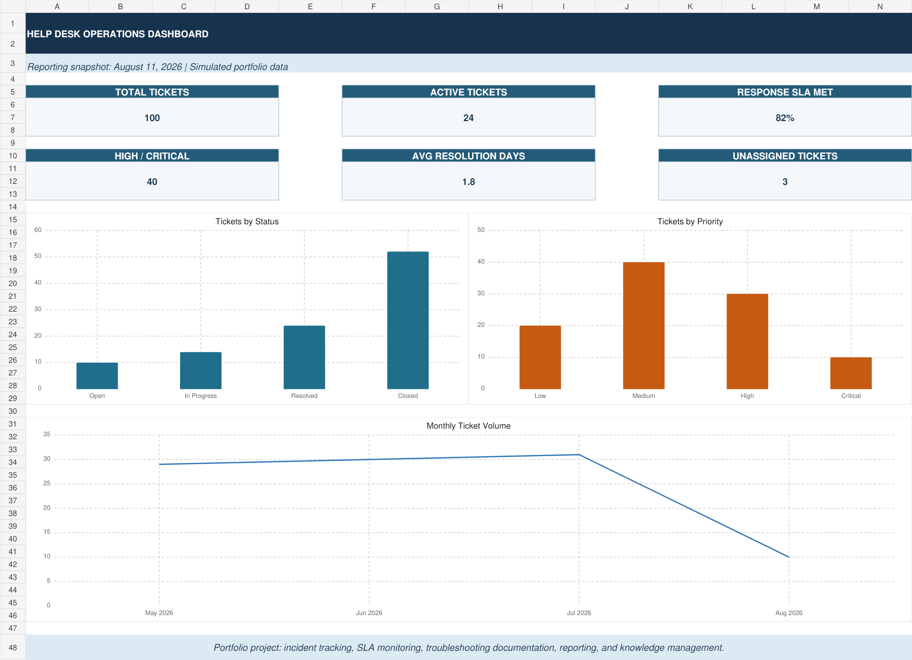

# Help Desk Ticketing System

An interactive Excel-based help desk ticketing system created as a simulated IT support portfolio project.

## Project Overview

This project demonstrates how an IT support team can document incidents, assign technicians, track service-level agreements, record troubleshooting work, verify resolutions, and report support performance.

## Main Features

- 100 realistic simulated help desk incidents
- Editable dropdowns for priority, status, department, issue type, and assigned technician
- Automatic response-SLA targets based on ticket priority
- SLA met or missed calculations
- Dynamic KPI dashboard and reporting charts
- Ticket Details screen with a Ticket ID dropdown
- Dedicated sections for the reported issue, troubleshooting steps, solution, and resolution verification
- User and asset directory containing 30 sample records
- Knowledge base containing 15 troubleshooting articles
- Conditional formatting for priority, status, and SLA results

## How to Use

1. Open **Andres Camacho ticketing sytem.xlsx** in Microsoft Excel.
2. Open the **Tickets** sheet.
3. Select a cell under **Priority ▼**, **Status ▼**, or **Assigned Technician ▼** to change its value.
4. Open **Ticket Details** and select a Ticket ID to review the complete incident.
5. Review the **Dashboard** and **Reports** sheets to see updated metrics.

## Skills Demonstrated

- Help desk ticket management
- Incident prioritization and escalation
- Service-level agreement tracking
- Technical troubleshooting documentation
- User and asset management
- Knowledge-base documentation
- KPI reporting and data visualization
- Excel formulas, tables, dropdown validation, conditional formatting, and charts
